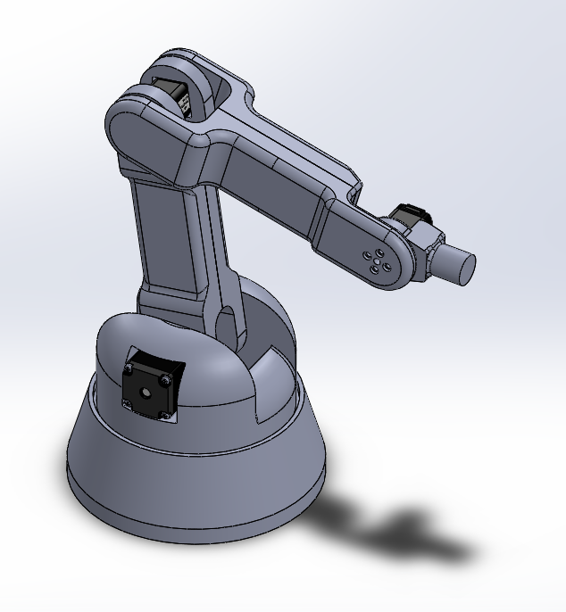

# 4 DOF Robotic Arm

This is the codebase and source for a custom 4 DOF robotic arm.

## Project Structure
The project source code for all running code needed to be on the Arduino board is under
the `src/` directory. Add the header files from `src/headers` as needed.

All the inverse kinematics and direct kinematics simulations and calculations
 can be found in the `simulation/` directory.

## Components

- 1x Arduino Uno/Mega/etc.
- 4x A4988 stepper controller
- 2x NEMA 11 stepper motors
- 2x NEMA 8 stepper motors
- 1x 12 - 48 V PSU
